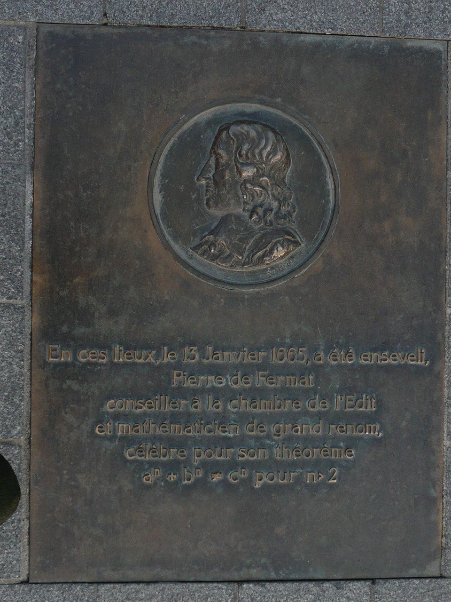

> കണക്കിലെ ഒരു കടുകട്ടിയായ പ്രശ്നം തെളിയിക്കാൻ നിങ്ങൾ എത്ര സമയം ചിലവഴിക്കും?
ഏതാനും മണീക്കൂറുകൾ? ഒരു ദിവസം? അതോ മാസങ്ങൾ? എന്നാൽ ഏഴുവർഷം സ്വന്തം മുറിയിൽ അടച്ചിട്ടിരുന്ന് ഒരു പ്രശ്നത്തിന് പരിഹാരം കണ്ട ആളെപ്പറ്റി കേട്ടിട്ടുണ്ടൊ?

എതാണ്ട് പത്ത് വർഷങ്ങൾക്ക് മുന്നെയാണ് ദ പ്രൂഫ് (The Proof) എന്ന ഡൊകുമെന്ററി ചിത്രം കാണാനിടയായത്. അന്നു മുതൽ ആൻഡ്ര്യൂ വൈൽസ് (Andrew Wiles) എന്ന ഗണിത ശാസ്ത്രജ്ഞൻ മനസ്സിൽ കയറിക്കൂടി. ഏതാണ്ടിതു പോലെ മനസ്സിനെ സ്വാധീനിച്ച പ്രതിഭകൾ അധികമില്ല ആധുനിക കാലത്ത്. ഒരാൾ ബ്ലൂ എൽഇഡി നിർമ്മിക്കുന്ന വിധം കണ്ടെത്തിയ ഷുജി നംകാമുറയാണെങ്കിൽ (Shuji Nakamura), മറ്റൊരാൾ ഗെയിം തിയറിയിൽ സിദ്ധാന്തങ്ങൾ രൂപപ്പെടുത്തിയ ജോൺ നാഷ് (John Nash) ആണ്. ഇവരിൽ ആൻഡ്ര്യൂ വൈൽസിന്റെ വഴികളിലൂടെ ഒരു സഞ്ചാരം നടത്തി നോക്കാം. 

## പിയർ ഡെ ഫെർമാ

പിയെ ഡെ ഫെമാ (Pierre de Fermat) തന്റെ ഒഴിവു സമയങ്ങളിൽ ഗണിത പ്രശ്നങ്ങൾക്ക് പരിഹാരം കണ്ടെത്താൻ ശ്രമിച്ച ഒരു അതുല്യ പ്രതിഭയായിരുന്നു. 

## ഫെർമായുടെ അവസാന സിദ്ധാന്തം
$x+y=z$ എന്ന സമവാക്യം തെളിയിക്കാൻ പറഞ്ഞാൽ സംഖ്യാ ശാസ്ത്രത്തിന്റെ ബാലപാഠങ്ങൾ പഠിച്ച ആർക്കും സാധിക്കാവുന്നതേയുള്ളൂ. ഈ സമവാക്യം പാലിക്കുന്ന അസംഖ്യം സംഖ്യകൾ കണ്ടെത്താവുന്നതാണ്.

എന്നാൽ $x^2+y^2=z^2$ എന്നായാൽ അല്പം ബുദ്ധിമുട്ടും. എങ്കിലും സ്വല്പം പരിശ്രമിച്ചാൽ ഇതിനും അസംഖ്യം വിലകൾ കണ്ടെത്താവുന്നതേയുള്ളൂ. പൈതഗോറസ് സിദ്ധാന്തം ഓർമ്മ വരുന്നുണ്ടൊ? ഇങ്ങിനെ ഉള്ള സമവാക്യങ്ങൾ പാലിക്കുന്നവയെ പൈതഗോറിയൻ ത്രയങ്ങൾ (Pythagorean Triple) എന്ന് വിളിക്കുന്നു. 

ഇനി $x^3+y^3=z^3$ എന്നായാലോ? 

ഗണിത ശാസ്ത്രജ്ഞന്മാർ ഇങ്ങിനെ അങ്ങ് ചിന്തിച്ച് എവിടെ വരെ എത്താം എന്ന് നോക്കിക്കളയും. അങ്ങിനെയാണ് ഗ്രീക്ക് ഗണിതജ്ഞനായ ഡയോഫാന്റസ് താഴെക്കാണുന്ന സമവാക്യം സൃഷ്ടിച്ചത്:

$A=x+y$,
$B=x^2+y^2$,
.
.
.
.
$C=x^n+y^n$.

ഡിയോഫാന്റസ് എഴുതിയ Arithmetica എന്ന പ്രാചീന ഗ്രന്ഥത്തിന്റെ ഒരു പ്രതി ഫെമായുടെ കൈവശം ഉണ്ടായിരുന്നു. ഇതിന്റെ താളുകളിൽ ഫെമായുടെ ചില കുറിപ്പുകൾ അദ്ദേഹത്തിന്റെ മരണശേഷം കണ്ടെത്തി. ഇതിൽ അദ്ദേഹം താൻ ഡിയോഫാന്റസ് സമവാക്യത്തിന്റെ തെളിവ് കണ്ടെത്തിയതായി കുറിച്ചിട്ടിരുന്നു. ഫെമായുടെ നോട്ട് പുസ്തകങ്ങളെല്ലാം നിരവധി ഗണിത സിദ്ധാന്തങ്ങളുടെ തെളിവുകൾ ഉണ്ടായിരുന്നെങ്കിൽ, ഇക്കാര്യത്തിനു മാത്രം ഒരു തെളിവും ആർക്കും കണ്ടെത്താൻ കഴിഞ്ഞില്ല. അങ്ങിനെ ഇത് ഫെമായുടെ അവസാനത്തെ സിദ്ധാന്തം (Fermat's Last Theorem) എന്നറിയപ്പെട്ടു. 

ഫെമാ എഴുതിയിട്ടത് ഇപ്രകാരമായിരുന്നു:

> "ഒരു പൂർണ്ണ സംഖ്യയുടെ മൂന്നാം വർഗത്തെ ഒരിക്കലും രണ്ട് സംഖ്യകളുടെ മൂന്നാം വർഗങ്ങളായും, ഒരു നാലാം വർഗത്തെ, രണ്ട് നാലാം വർഗങ്ങളായും പിരിച്ചെഴുതാനാവില്ല, രണ്ടാം വർഗത്തേക്കാൾ വലിയ ഒരു സംഖ്യയേയും ഇങ്ങിനെ പിരിച്ചെഴുതാൻ സാധ്യമല്ല. ഇതിനു അതിമനോഹരമായ തെളിവ് ഞാൻ കണ്ടെത്തിയിട്ടുണ്ട്, പക്ഷെ ഈ പുസ്തകത്തിന്റെ അരിക് അതെഴുതാൻ മതിയാവില്ല."

Fermat's last theorem is a theorem first proposed by Fermat in the form of a note scribbled in the margin of his copy of the ancient Greek text Arithmetica by Diophantus. The scribbled note was discovered posthumously, and the original is now lost. However, a copy was preserved in a book published by Fermat's son. In the note, Fermat claimed to have discovered a proof that the Diophantine equation x^n+y^n=z^n has no integer solutions for n>2 and x,y,z!=0.

## തെളിയിക്കാനുള്ള ശ്രമങ്ങൾ
Fermat's Last Theorem has the peculiar distinction of being the mathematical problem for which the greatest number of incorrect proofs have been published

## ആൻഡ്ര്യൂ വൈൽസ്
ആൻഡ്ര്യൂ വൈൽസ് തന്റെ വയസ്സിൽ ഒരു ലൈബ്രറിയിൽ വച്ചാണ് ആദ്യമായി ഫെർമായുടെ അവസാന സിദ്ധാന്തം വായിക്കുന്നത്. അന്നു വരെ ആരുമിത് തെളിയിച്ചിട്ടില്ല എന്നത് വിദ്യാർത്ഥിയായ ആൻഡ്ര്യൂവിന്റെ മനസ്സിലുടക്കി.

## ഏബൽ പ്രൈസ് 

## ഗണിതമെന്ന ലഹരി

