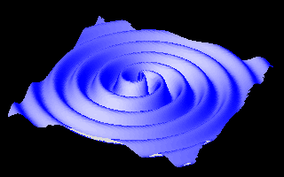
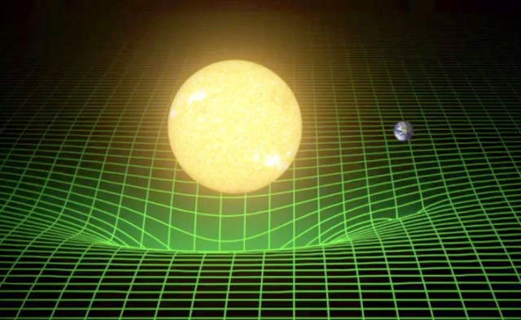
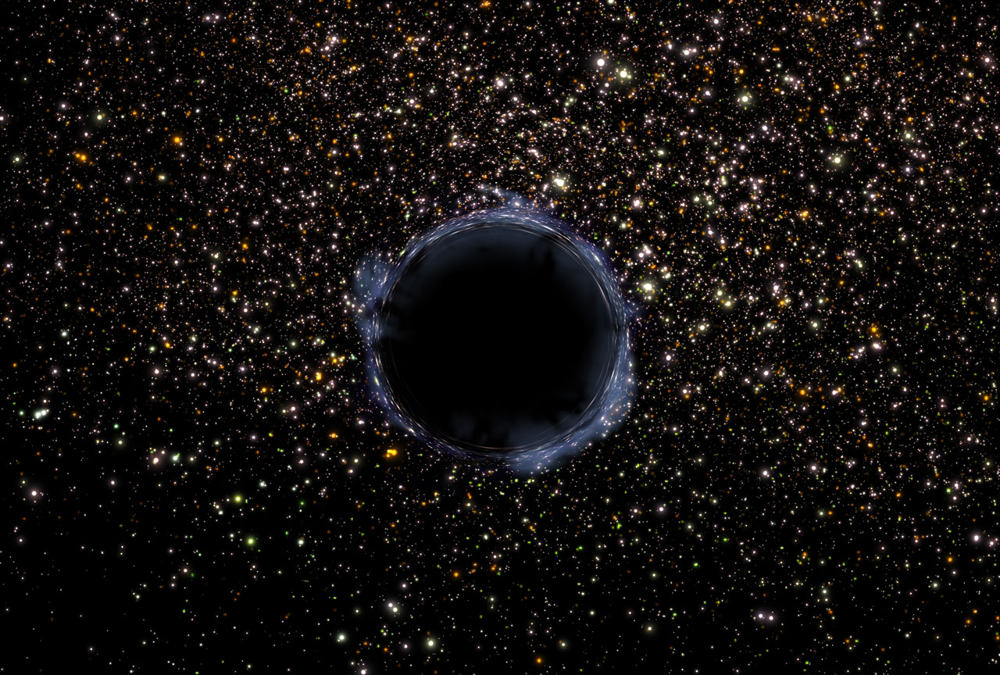
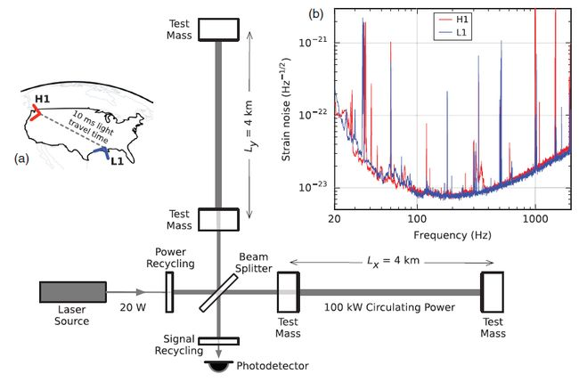

>"എന്റെ ജീവിതത്തിലെ ഏറ്റവും മനോഹരമായ ചിന്തയായിരുന്നു അത്."
ആൽബർട് ഐൻസ്റ്റൈൻ.

ഏത് മനോഹര ചിന്തയാവാം ഐൻസ്റ്റൈനെ ഇങ്ങിനെ പറയാൻ പ്രേരിപ്പിച്ചത്?

സ്കൂൾ വിദ്യാർത്ഥിയായിരുന്ന കാലത്ത് ഐൻസ്റ്റൈൻ ചിന്തിച്ചിരുന്നതും, മനസ്സാ സാങ്കല്പിക പരീക്ഷണങ്ങൾ (Thought Experiments) നടത്തിയിരുന്നതും, പ്രകാശത്തോടൊപ്പം സഞ്ചരിച്ചാൽ എന്തായിരിക്കും അവസ്ഥ എന്നതിനെക്കുറിച്ചായിരുന്നു. പിന്നീട് കുറെക്കാലം ജോലിയില്ലാതെ കഷ്ടപ്പെട്ടപ്പോഴും, സ്വിസ്സ് പേറ്റന്റ് ഓഫീസിൽ ജോലി ചെയ്തപ്പോഴും ഈവിധ ചിന്തകൾ മനസ്സിൽ നിന്നും കളയാതെ കൊണ്ട് നടന്ന് കുരുക്കഴിച്ച്, 1905-ൽ ആപേക്ഷിക സിദ്ധാന്തമായി (Special Theory of Relativity) അവതരിപ്പിച്ചു. ഇതിന്റെ കാതലായ കണ്ടെത്തൽ സമയം കേവലമായ (absolute) ഒന്നല്ല പകരം ആപേക്ഷികമാണ് (relative) എന്നതായിരുന്നു. "എന്താണ് സമയം?" (time) എന്നത് പൗരാണിക കാലം മുതൽക്ക് ശാസ്ത്ര-തത്വചിന്താ വിശാരദന്മാർ ഒരു പോലെ കൊണ്ട് നടന്ന് പരിഹരിക്കാൻ ശ്രമിച്ച ഒരു ചോദ്യമായിരുന്നു. ഐൻസ്റ്റൈന്റെ ഭാഷയിൽ പറഞ്ഞാൽ സമയമെന്നത് പരമമായ, എല്ലാവർക്കും ഒരു പോലെയുള്ള, ഒരു പ്രാപഞ്ചിക സത്യമല്ല മറിച്ച് നമ്മൾ ക്ലോക്കുകളിൽ നിന്ന് മനസ്സിലാക്കുന്ന ഒന്നത്രെ! വിവിധ വേഗതകളിൽ സഞ്ചരിക്കുന്ന ആരുടെയും ക്ലോക്കുകൾ ഒരിക്കലും ഒരേ സമയ ദൈർഘ്യം കാണിക്കാൻ സാദ്ധ്യത ഇല്ലാത്തതിനാൽ, ഇവർ ദർശിക്കുന്ന ഭൗതിക പ്രതിഭാസങ്ങളും ആപേക്ഷികമായിരിക്കും. എന്നാൽ ഇതിന്റെ പിന്നിലെ ഭൗതികശാസ്ത്ര നിയമങ്ങൾ മാറില്ല എന്ന ഗലീലിയൻ തത്വത്തിന് ഐൻസ്റ്റൈൻ ഈ സിദ്ധാന്തം വഴി അടിവരയിട്ടു.

***

ഒരേ സമയം പല ചിന്തകൾ കൊണ്ട് നടക്കാനും അതിൽ മുഴുകി പഠനങ്ങൾ നടത്താനും ഐൻസ്റ്റൈനുള്ള കഴിവ് അപാരമായിരുന്നു. എന്നാൽ ധാരാളം തെറ്റുകളും അദ്ദേഹം വരുത്തിയിരുന്നു. ആ തെറ്റുകൾ തിരുത്താനുള്ള അദ്ദേഹത്തിന്റെ സ്ഥിരോത്സാഹമാണ് അദ്ദേഹത്തെ ഒരു പ്രതിഭ എന്ന നിലയിൽ ലോക പ്രശസ്തനാക്കിയത്. ശാസ്ത്രത്തോടൊപ്പം തത്വശാസ്ത്രവും വായിക്കുകയും സുഹൃത്തുക്കളോടൊപ്പം പങ്കു വയ്ക്കുകയും ചെയ്തിരുന്ന ഗണിതം നല്ല വശമായിരുന്നെങ്കിലും, അത് അത്ര പ്രാധാന്യമുള്ളതല്ല എന്ന ചിന്ത അതിൽ കാര്യമായി ശ്രദ്ധിക്കുന്നതിൽ നിന്നും അദ്ദേഹത്തെ പിന്തിരിപ്പിച്ചു. എന്നാൽ, തത്വശാസ്ത്രം അദ്ദേഹത്തെ പ്രാപഞ്ചിക പ്രതിഭാസങ്ങളുടെ ഭൗതികമായ ഉറവിടങ്ങളിലേക്കുള്ള ചിന്തയിലേക്കും നയിച്ചു. പുരാതനകാലം മുതൽക്കേ ചിലർ താഴെക്കൊടുത്തിരിക്കുന്ന തരം ചില ഉന്നത് ചിന്തകൾ പങ്ക് വച്ചിരുന്നു.

> "ഒന്നുമില്ലായ്മയിൽ നിന്നും ഒന്നുമുണ്ടാകുന്നില്ല." - പാർമിനിഡീസ്.
> "എല്ലാം എപ്പോഴും ഒഴുകിക്കൊണ്ടിരിക്കുന്നു." - ഹെറാക്ലിറ്റസ്.

നമുക്കൊരിക്കലും ഒരേ നദിയിൽ രണ്ട് തവണ ഇറങ്ങാൻ സാധിക്കില്ല, ഒന്നുകിൽ നമ്മൾ അല്ലെങ്കിൽ നദി മാറിയിട്ടുണ്ടാവും, എന്ന ആപ്തവാക്യം ഹെറാക്ലിറ്റസിന്റേതാണ് . ഇത് അദ്ദേഹത്തിന്റെ ശക്തമായ നിരീക്ഷണ പാടവത്തെ സൂചിപ്പിക്കുന്നു. എല്ലാം മാറിക്കൊണ്ടിരിക്കുന്നു, സ്ഥായിയായി ഒന്നുമില്ല എന്ന കണ്ടെത്തലിൽ ഇതടങ്ങിയിരിക്കുന്നു. അനുഭവമാണ് ജ്ഞാനത്തിന്റെ അടിസ്ഥാനമെന്ന വിശ്വാസത്തിലുറച്ച (Empiricism) ഇൻഡക്ടീവ് (Inductive) രീതിയിലുള്ള യുക്തിവിചാരം നമുക്കിതിൽ ദർശിക്കാം. എന്നാൽ, പാർമിനീഡിസിന്റേത് എല്ലാത്തരം നിരീക്ഷണങ്ങൾക്കും മുകളിൽ മനുഷ്യന്റെ യുക്തിയെ മുൻ നിർത്തിയുള്ള (Rationalism) അനുമാനങ്ങളിലെത്തിച്ചേരുന്ന രീതിയെ  (Deductive Reasoning) സൂചീപ്പിക്കുന്നു. നൂറ്റാണ്ടുകളിലൂടെ ഇത് പലരും കൈമാറിപ്പോന്നെങ്കിലും സമാന്തരമായായിരുന്നു വളർച്ച. നൂറ്റാണ്ടുകളോളം പല ചിന്തകരും ഇതിന്റെ പേരിൽ ആശയങ്ങൾ കൊണ്ട് പയറ്റിയതിന്റെ ഫലമായി ചിലർ ഇവയെ ബന്ധിപ്പിച്ച്, രണ്ടും ചേർന്ന രീതികൾ ശാസ്ത്രത്തിൽ പ്രയോഗിക്കപ്പെടുന്നുണ്ട്.

ഗ്രീക്ക് തത്വചിന്തകരെ വായിച്ച് തുടങ്ങിയ ഐൻസ്റ്റൈന്റെ ഇഷ്ട തത്വചിന്തകൻ തുടക്കത്തിൽ ഇമ്മാനുവൽ കാന്റ് (Immanuel Kant) ആയിരുന്നു. തുടക്കത്തിലെ ഹൃദ്യമാക്കിയ കാന്റിന്റെ "Critique of Pure Reason" എന്ന മഹദ് ഗ്രന്ഥം  അദ്ദേഹത്തെ ഡേവിഡ് ഹ്യൂമിലേക്കും (David Hume), ഏൺസ്റ്റ് മാകിലേക്കും (Earnst Mach), തദ്വാരാ ഭൗതികയാഥാർത്ഥ്യം എന്ത് എന്ന അന്വേഷണത്തിലേക്കും നയിച്ചു. ഇതിലേക്കുള്ള ഒരു ചുവടു വയ്പ് മാത്രമായിരുന്നു ആപേക്ഷികസിദ്ധാന്തം (Special Relativity). നിരവധി പരീക്ഷണങ്ങൾ അദ്ദേഹം വിഭാവനം ചെയ്തിരുന്നെങ്കിലും യുക്തിയുടെ അപ്രമാദിത്വം തന്നെയായിരുന്നു അദ്ദേഹത്തിന്റെ ചിന്തകളുടെ കാതൽ. എങ്കിലും ഈ വാദത്തെ തുറന്നെതിർത്തിരുന്ന ഹ്യൂമിന്റെ നാസ്തിക ചിന്ത (Skepticism) അദ്ദേഹത്തെ വളരെയധികം സ്വാധീനിച്ചു. സത്യമറിയാൻ വേറിട്ട വഴിയിൽ സഞ്ചരിക്കണം എന്ന ചിന്ത അദ്ദേഹം 1901-ൽ ഒരു സുഹൃത്തിനയച്ച കത്തിൽ ഇവ്വിധം സൂചിപ്പിച്ചു:

> "അധികാരസ്ഥാനങ്ങളിലുള്ള മൗഡ്യമായ വിശ്വാസമാണ് സത്യത്തിന്റെ ഏറ്റവും വലിയ ശത്രു."

ഐൻസ്റ്റൈന്റെ ആദ്യകാല പ്രസിദ്ധീകരണങ്ങളുടെയൊക്കെ ഉള്ളടക്കം ഈവിധം മേൽക്കോയ്മകളെയും ശാസ്ത്രത്തിലെ അധികാരസ്ഥാനങ്ങളെയും വിപ്ലവകരമായി ചോദ്യം ചെയ്യുന്നതായിരുന്നു. തലക്കെട്ട് മുതൽ ഉള്ളടക്കം വരെ ഈ വിധത്തിൽ വൈവിധ്യം നിറഞ്ഞ പേപ്പറുകളാണ് അദ്ദേഹം 1905 എന്ന മാന്ത്രിക വർഷത്തിൽ പ്രസിദ്ധീകരിച്ചത്.

***

## തുല്യതാ സിദ്ധാന്തം (Principle of Equivalence)

1905-ലെ ആപേക്ഷിക സിദ്ധാന്തത്തിൽ രണ്ട് പ്രധാന പ്രശ്നങ്ങൾ ഐൻസ്റ്റൈൻ കണ്ടെത്തി. ഒന്നാമതായി, ഈ സിദ്ധാന്ത പ്രകാരം ഭൗതികമായ ഒന്നിനും പ്രകാശത്തേക്കാൽ വേഗത്തിൽ സഞ്ചരിക്കാൻ സാധിക്കില്ല. ഇത് ന്യൂട്ടന്റെ ഗുരുത്വാകർഷണ നിയമ പ്രകാരം പിണ്ഡമുള്ള വസ്തുക്കൾ പരസ്പരം ആകർഷിക്കുന്നത് ഒട്ടും സമയം എടുക്കാതെ ഉടനടി സംഭവിക്കുന്നതാണെന്ന (instantaneous) സിദ്ധാന്തത്തെ ഖണ്ഡിക്കുന്നു. രണ്ടാമത്തെ പ്രശ്നം ആപേക്ഷിക സിദ്ധാന്തം പരസ്പരം  സ്ഥിര വേഗത്തിൽ (constnat velocity) സഞ്ചരിക്കുന്ന രണ്ട് അവസ്ഥകൾ (intertial frames)  തമ്മിലുള്ള താരതമ്യ പഠനത്തിനെ ഉപകരിക്കൂ എന്നതായിരുന്നു. ഇവ പരിഹരിക്കാനായി നീണ്ട പത്ത് വർഷമെടുത്ത് അദ്ദേഹം ഒരു പൊതു ഗുരുത്വാകർഷണ സിദ്ധാന്തം (General Relativity) കൊണ്ട് വന്നു.

1907-ൽ ഒരു വാർഷികപ്പതിപ്പിനു വേണ്ടി ആപേക്ഷിക സിദ്ധാന്തപ്പറ്റി ബേണിലുള്ള സ്വിസ്സ് പേറ്റന്റ് ഓഫീസിലിരുന്ന് എഴുതുമ്പോഴാണ് ഇതിലേക്ക് നയിച്ച ആ മനോഹരമായ ചിന്ത അദ്ദേഹത്തിനു ഉണ്ടായത്.  ഒരു ലിഫ്റ്റിൽ സഞ്ചരിക്കുന്ന ഒരാൾക്ക് പെട്ടെന്നത് പൊട്ടി വീണാൽ എന്തായിരിക്കും അനുഭവിക്കാനാവുക എന്നാലോചിച്ച അദ്ദേഹത്തിന്, ഇതിൽ നിന്നും തുല്യതാ സിദ്ധാന്തം (Principle of Equivalence) എന്ന മഹത്തായ ഒരു ആശയം വാർത്തെടുക്കാൻ കഴിഞ്ഞു. പൂർണ്ണമായും അടച്ചുകെട്ടിയ ഒരു ലിഫ്റ്റിൽ പുറം ലോകവുമായി  ബന്ധമില്ലാതെ ആയിരിക്കുന്ന ഒരാൾക്ക് തനിക്ക് തറയിൽ ചവിട്ടി നിൽക്കാൻ സാധിക്കുന്നത് ഭൂഗുരുത്വബലം തന്നെ താഴേക്ക് വലിക്കുന്നത് കൊണ്ടാണോ അതോ യാതോരു ഗുരുത്വാകർഷണ ബലവും ഇല്ലാത്ത (Gravitational Force), ബഹിരാകാശം പോലെ, ഒരിടത്ത് ആരെങ്കിലം ഈലിഫ്റ്റിനെ ഭൂമിക്ക് തുല്യമായ ഒരു ബലത്തിൽ മേൽപ്പോട്ട് വലിക്കുമ്പോൾ തറയിൽ ചവിട്ടി നിൽക്കാൻ കഴിയുന്നതു കൊണ്ടാണോ എന്ന് തിരിച്ചറിയാൻ കഴിയില്ല എന്നതാണ് ഇതിന്റെ സാരം. ഇതേ പോലെ ലിഫ്റ്റ് പൊട്ടി വീണാലും, ബഹിരാകാശത്ത് നടക്കാൻ ശ്രമിച്ചാലും ഭാരം അനുഭവപ്പെടാത്ത ഒരേ ഫലം ഉണ്ടാവുകയും,  അടച്ച മുറിയിലുള്ളൊരാൾക്ക് രണ്ടും തിരിച്ചറിയാൻ സാധിക്കാതെയും വരും എന്നതും ഇതേ സിദ്ധാന്ത തന്നെയാണ്.

***

## പൊതു ആപേക്ഷികതാ സിദ്ധാന്തം (General Relativity)

പിന്നീട് നാലു വർഷത്തേക്ക് കാര്യമായ പുരോഗതി ഇക്കാര്യത്തിൽ ഉണ്ടായില്ല. ഇക്കാലമത്രയും പ്രകാശ കണികകളിൽ ശ്രദ്ധ പതിപ്പിച്ച ഐൻസ്റ്റൈൻ 1911-ൽ "പ്രകാശത്തിന്റെ സഞ്ചാരത്തിൽ ഗ്രാവിറ്റിയുടെ സ്വാധീനം" എന്ന പ്രസിദ്ധീകരണത്തിന്റെ തുടർച്ചയായി നടത്തിയ കണക്ക് കൂട്ടലുകൾ വഴി സൂര്യന്റെ ആകർഷണത്തിന് അതിനടുത്തു കൂടി കടന്നു പോകുന്ന പ്രകാശ രശ്മികളെ ഒരു ആർകിന്റെ 0.83 സെക്കന്റ് (0.83 arc second) വ്യതിചലിപ്പിക്കാൻ കഴിയും എന്ന് കണ്ടെത്തി. ഇതിനദ്ദേഹം ന്യൂട്ടന്റെ പ്രകാശ കണികാ സിദ്ധാന്തമാണ് ഉപയോഗിച്ചത്. ഇതിനദ്ദേഹം തന്റെ സ്വതസിദ്ധമായ ഡിഡക്ടീവ് രീതി തന്നെയാണ് ഉപയൊഗിച്ചത്. മാത്രമല്ല ഇത് ശരിയൊ എന്ന് വിലയിത്താനുള്ള പരീക്ഷണങ്ങൾ നടത്താൻ ശാസ്ത്രലോകത്തോട് ആഹ്യാനം ചെയ്യുകയും ചെയ്തു. പക്ഷെ ഇതിനു വേണ്ട സാഹചര്യം ഉണ്ടാക്കാൻ ആർക്കും സാധിക്കുന്നതിനു മുന്നെ ഒന്നാം ലോക മഹായുദ്ധം പൊട്ടിപ്പുറപ്പെട്ടു.

പണ്ട് ഗണിതശാസ്ത്രത്തിൽ കാണിച്ച ഉപേക്ഷ പക്ഷെ ഐൻസ്റ്റൈനു ഇക്കാലയളവിൽ ഒരു ന്യൂനതയായി അനുഭവപ്പെടാൻ തുടങ്ങി. പ്രത്യേകിച്ചും കാലം തള്ളിക്കളഞ്ഞ ന്യൂട്ടന്റെ ആശയം ഉപയോഗിക്കേണ്ടി വന്നപ്പോൾ അതല്ല ശരിയെന്ന് കാണിക്കാൻ അറിയാവുന്ന ഗണിതം പോരാതെ വന്നു. അങ്ങിനെ അദ്ദേഹം സൂറിക്കിലേക്ക് മടങ്ങി തന്റെ ആത്മമിത്രമായ മാഴ്സൽ ഗ്രോസ്സ്മാന്റെ (Marcel Grossmann) സഹായം തേടി. ആപേക്ഷിക സിദ്ധാന്തം സ്ഥലവും (space) കാലവും (time) വേറിട്ട് കാണേണ്ട ഒന്നല്ല, പകരം ഒന്നായി കാണേണ്ട ഒന്നാണ് (space-time) എന്ന് സ്ഥാപിച്ചിരുന്നു. ഐൻസ്റ്റൈന്റെ ഗണിതാദ്ധ്യാപകനായിരുന്ന ഹെർമൻ മിങ്കോവ്സ്കി (Herman Minkowski) ഇതിനു വേണ്ട ഗണിതം രൂപപ്പെടുത്തിയിരുന്നു. എന്നാൽ ഗ്രാവിറ്റി എന്നാൽ ഈ സ്പേസ്-ടൈമിന്റെ വക്രത (curvature) മൂലമാണെന്നതായിരുന്നും പൊതുസിദ്ധാന്തത്തിന്റെ കണ്ടെത്തൽ. ഇത് സ്ഥാപിക്കാനാവശ്യമായ ഗണിതം ഗൗസും (Carl Friedrich Gauss) ശിഷ്യനായ ബെർണാഡ് റീമാനും (Bernhard Riemann) ചേർന്ന് രൂപപ്പെടുത്തിയ നോൺ-യൂക്ലീഡിയൻ ജ്യോമട്രി ആണെന്ന് ഗ്രോസ്സ്മാൻ ബോദ്ധ്യപ്പെടുത്തി. ഇത് യൂക്ലിഡിന്റെ, ന്യൂട്ടന്റെയും ഗലീലിയോയുടെയും ആശയങ്ങൾ പ്രാവർത്തികമാകുന്ന, പരന്ന ലോകത്തിൽ നിന്നും ഐൻസ്റ്റൈൻ വിഭാവനം ചെയ്ത ലോകത്തേക്ക് എത്തിക്കുന്ന ഗണിത പാലമായി പിന്നീട് മാറി.

ഈ ലോകത്തിന്റെ ഗണിതം കൈകാര്യം ചെയ്യാനുള്ള ആയുധമായി അവർ ഉപയൊഗിച്ചത് ഇറ്റാലിയൻ ഗണിത ശാസ്ത്രജ്ഞരായ റിക്കിയും (Gregorio Ricci-Curbastro) ലെവി-സിവിറ്റയും (Tullio Levi-Civita) അവതരിപ്പിച്ച ടെൻസർ എന്ന രൂപത്തിന്റെ പരിഷ്കരിച്ച രൂപമാണ്. ഇത് വഴി ആപേക്ഷിക സിദ്ധാന്തത്തിന്റെ ഒരു മൂലക്കല്ലായ, ഭൗതിക ശാസ്ത്ര തത്വങ്ങൾ എല്ലാവർക്കും എവിടെയും ഒരു പോലെ വിശദീകരണ യോഗ്യമായ്യിരിക്കണം എന്ന ആശയം ഒരു പൊതു തത്വമായി മുന്നോട്ട് വയ്ക്കാൻ സാധിച്ചു. 1915, നവമ്പർ 25-ന് “The Field Equations of Gravitation,” എന്ന ഒരു പ്രഭാഷണത്തിൽ ഗ്രാവിറ്റിയുടെ പൊതു നിയമം ഒരു ഫീൽഡ് സമവാക്യം (Field Equation) ആയി  താഴെക്കാണും വിധം അദ്ദേഹം അവതരിപ്പിച്ചു.

$G_{\mu\nu}=4\piT_{\mu\nu}$

ഇതിൽ G ഐൻസ്റ്റൈൻ ടെൻസറെന്നറിയപ്പെടുന്നു, ഇതിന്റെ നിർവചനം താഴെപ്പറയും വിധമാണ്.

$G_{\mu\nu}=R_{\mu\nu}-\frac{1}{2}g_{\mu\nu}R$

ഐൻസ്റ്റൈൻ ഫീൽഡ് സമവാക്യം സ്ഥലകാലം (space-time) എങ്ങിനെ വക്രതയുള്ളതാകുന്നുവെന്നും, ആദ്യത്തെ സമവാക്യത്തിന്റെ വലതു ഭാഗത്തുള്ള T വസ്തുക്കളുടെ പിണ്ഡം (mass) എങ്ങിനെ അതിനു കാരണമാകുന്നുവെന്നും സൂചിപ്പിക്കുന്നു. ഇതിന്റെ മറ്റൊരു വ്യാഖ്യാനപ്രകാരം സ്ഥലകാലത്തിന്റെ വക്രതയാണ് ഗുരുത്വാകർഷണം ഉണ്ടാക്കുന്നതെന്ന് മനസ്സിലാക്കാം. ഇതിൽ R വക്രതയെ സൂചിപ്പിക്കുന്നു. സ്റ്റ്രെസ്സ്-എനർജി ടെൻസർ T മാസ്സും ഊർജ്ജവും രണ്ടല്ല പരസ്പര പൂരകങ്ങളാണ് എന്ന ആപേക്ഷിക സിദ്ധാന്തത്തിന്റെ, ഒരു പക്ഷെ ഏറ്റവും മാരകമായ, ഒരു കണ്ടെത്തലിനെ കുറിക്കുന്നു. ലളിതമായ ഭാഷയിൽ പറഞ്ഞാൽ ഇലാസ്തികതയുള്ള ഒരു പ്രതലത്തിൽ ഒരു ഭാരമുള്ള പന്ത് വച്ചാൽ അതുണ്ടാക്കുന്ന കുഴിയിലേക്ക് ആ പരിസരത്തുള്ള ചെറിയ വസ്തുക്കളെല്ലാം വീഴും. അതായത് ഭാരമുള്ള വസ്തുക്കൾ പരസ്പരം സ്പേസ്-ടൈമിൽ സൃഷ്ടിക്കുന്ന വക്രത മൂലമുള്ള പരസ്പര പതനമാണ് ഗുരുത്വാകർഷണം. ഇങ്ങിനെ നോക്കിയാൽ സൂര്യൻ സൃഷ്ടിക്കുന്ന വക്രതയിലേക്ക് ഭൂമി സഞ്ചരിക്കുന്നതിനെയാണ് ഭ്രമണം എന്ന് നമ്മൾ വിളിക്കുന്നത്. ഓർത്തിരിക്കേണ്ട പ്രധാന കാര്യം ഇങ്ങിനെ ഉണ്ടാകുന്ന വക്രത സ്ഥലവും കാലവും ഒന്ന് ചേരുന്ന നാലു മാനങ്ങൾ (Four Dimensions) ഉള്ള ഒരു ലോകത്താണ് അനുഭവവേദ്യമാകുന്നത്, അല്ലാതെ നമ്മുടെ ഇന്ദ്രിയങ്ങൾക്ക് നേരിട്ട് വഴങ്ങുന്ന തലത്തിലല്ല എന്നതാണ്.

ഈ കണ്ടെത്തലുകൾ ക്രോഡീകരിച്ചാൽ പരസ്പര പൂരകങ്ങളായ രണ്ട് ചോദ്യങ്ങൾക്ക് ഉത്തരം ലഭിക്കും:

1. ഗുരുത്വാകർഷണ പ്രഭാവം എങ്ങിനെയാണ് പിണ്ഡമുള്ള പദാർത്ഥങ്ങളെ സ്വാധീനിച്ച് അവയെ ചലിപ്പിക്കുന്നത്?
2. പിണ്ഡമുള്ള പദാർത്ഥങ്ങൾ എങ്ങിനെ സ്ഥലകാലത്തിൽ ഗുരുത്വാകർഷണ പ്രഭാവം  സൃഷ്ടിച്ച് അതിനെ വക്രതയുള്ളതാക്കുന്നു?

>"ഗുരുത്വാകർഷണ നിയമം പോലെ ഒന്നിന്റെ പ്രസക്തിയെന്തെന്നാൽ, പ്രപഞ്ചത്തിന് ഒന്നുമില്ലായ്മയിൽ നിന്ന് സ്വയം സൃഷ്ടിക്കാൻ സാധിക്കുമെന്നതാണ്." - സ്റ്റീഫൻ ഹോക്കിങ്.

സ്റ്റീഫൻ ഹോകിങ്ങ് സൂചിപ്പിച്ചതുപോലെ പ്രപഞ്ചത്തിനു സ്വയം ചലിക്കാൻ സാധിക്കും, അതിന്റെ പിന്നിലൊരു അദൃശ്യ ശക്തി ആവശ്യമില്ല എന്നത് തന്നെയാണ് ഇതിന്റെ ഏറ്റവും വലിയ മഹത്വം. വേറൊരർത്ഥത്തിൽ പാർമിനിഡീസ് പറഞ്ഞത് തന്നെ, ഒന്നുമില്ലായ്മയിൽ നിന്നല്ല പ്രപഞ്ചം ഉണ്ടായത്, അതോടൊപ്പം ഐൻസ്റ്റൈൻ കണ്ടെത്തിയത് പ്രപഞ്ചം അനന്തമല്ല അതിനൊരു പരിധിയുണ്ടെന്നാണ്. എന്നാൽ വസ്തുക്കൾക്ക് പിണ്ഡം, ചാർജ്ജ് തുടങ്ങിയവ എങ്ങിനെ ഉണ്ടായി എന്ന് പറയാൻ ഇപ്പോഴും കൃത്യമായ ഒരു സിദ്ധാന്തവും ഇല്ല എന്നതും ഇതോടൊപ്പം മനസ്സിലാക്കേണ്ടതുണ്ട്. ഗണിതശാസ്ത്രരൂപത്തിൽ, ഇതേ സമവാക്യത്തിൽ ആദ്യം എത്തിച്ചേർന്നത് പ്രശസ്ത ഗണിതശാസ്ത്രജ്ഞനും ഐൻസ്റ്റൈന്റെ സുഹൃത്തുമായിരുന്ന ഡേവിഡ് ഹിൽബർട് (David Hilbert) ആയിരുന്നു എന്ന കാര്യവും സ്മരിക്കേണ്ടതുണ്ട്. ആരാദ്യം ഇതിലെത്തിച്ചേരുമെന്ന്, ഇവർ തമ്മിൽ ഒരു സൗഹൃദപരമായ ഒരു മത്സരവും ഉണ്ടായിരുന്നു. ഗോട്ടിങ്ങൻ സർവകലാശാലയിൽ പ്രവർത്തിച്ചിരുന്ന ഹിൽബർടിന്റെ വാക്കുകൾ കടമെടുത്താൽ:

> "ഗോട്ടിങ്ങൻ നഗരത്തിന്റെ തെരുവുകളിലുള്ള ഓരോ കുട്ടിക്കു പോലും നാല്-അളവുകളിലുള്ള ജ്യാമിതിയെപ്പറ്റി ഐൻസ്റ്റൈനെക്കാൾ നന്നായി അറിയാം. എന്നിരിക്കിലും അതിന്റെ പഠനങ്ങൾ നടത്തിയത്  ഗണിതശാസ്ത്രജ്ഞരല്ല, മറിച്ച് ഐൻസ്റ്റൈനാണ്."

അങ്ങിനെ 36 വയസ്സുള്ള ഐൻസ്റ്റൈൻ മനുഷ്യചരിത്രത്തിൽ പ്രപഞ്ചത്തെപ്പറ്റിയുള്ള ഏറ്റവും ഭാവനാപരവും, അതോടൊപ്പം നാടകീയവുമായ ആശയം ലോകത്തിനു മുമ്പാകെ അവതരിപ്പിച്ചു. അതിനേക്കാളുപരി അദ്ദേഹം ഇതിൽ നിന്നും നടത്തിയ കണക്കു കൂട്ടലുകളും, പ്രവചനങ്ങളും ഇന്നും ശാസ്ത്രത്തെ വിസ്മയിപ്പിക്കുന്നവയാണ്.

***

## പൊതുസിദ്ധാന്തത്തിന്റെ ഫലങ്ങൾ

ഈ പുതിയ സിദ്ധാന്തത്തിന്റെ ഒരു പ്രധാന കണ്ടെത്തൽ സൂര്യന്റെ ഗുരുത്വാകർഷണം പ്രകാശ പാതകൾക്ക് വ്യതിചലനം ഉണ്ടാക്കുന്നത് 0.83 ആർക് സെക്കന്റ് അല്ല പകരം അതിന്റെ ഇരട്ടിയിലധികം വരുന്ന 1.7 ആർക് സെക്കന്റുകൾ ആണ് എന്നതായിരുന്നു. തന്റെ കണക്കുകൂട്ടൽ പ്രകാരം ഭൂമിയിൽനിന്നും നോക്ക്മ്പോൾ സൂര്യന്റെ മറുവശത്തുള്ള നക്ഷത്ത്രങ്ങൾ 1.7 ആർക് സെക്കന്റ് വ്യതിചലിച്ച് സ്ഥിതി ചെയ്യുന്നതായി കാണാം എന്ന് വിവക്ഷ. ഇത് തെളിയിക്കാൻ അദ്ദേഹം ശാസ്ത്രലോകത്തോട് ആഹ്വാനം ചെയ്തു. എന്നാൽ അതിനാവശ്യമായ ഒരു പൂർണ്ണ സൂര്യഗ്രഹണത്തിനായി 1919 മെയ് മാസം 29-ന് വരെ കാത്തിരിക്കേണ്ടി വന്നു. ഇത് തെളിയിച്ചതാകട്ടെ ബ്രിട്ടനിലെ കേംബ്രിഡ്ജ് വാന നിരീക്ഷണശാലയുടെ മേധാവിയായിരുന്ന ആർതർ എഡിംങ്ടൻ (Arthur Eddington) സംഘവും. ആ സംഘം പടിഞ്ഞാറൻ ആഫ്രിക്കൻ ദ്വീപായ പ്രിൻസിപ്പിയിൽ ക്യാമറയിൽ പകർത്തിയ നാല് ചിത്രങ്ങൾ പൊതു ഗുരുത്വാകർഷണ സിദ്ധാന്തത്തെ ലോക പ്രശസ്തമാക്കി (ഐൻസ്റ്റൈൻ ആന്റ് എഡിങ്ടൻ (Einstein and Eddington) എന്ന 2008-ലെ HBO ചലച്ചിത്രം ഒന്നാം ലോകമഹായുദ്ധത്തിന്റെ വെളിച്ചത്തിൽ ഇതിന്റെ ഉദ്വേഗജനകമായ കഥ പറയുന്ന ഒന്നാണ്).

ബ്രിട്ടീഷ് റോയൽ അക്കാദമിയിലെ റോയൽ അസ്റ്റ്രോണൊമർ ആയിരുന്ന സർ ഫ്രാങ്ക് ഡൈസനാണ് എഡിങ്ങ്ടന്റെ കണ്ടെത്തലുകൾ റോയൽ അസ്റ്റ്രോണമിക്കൽ സൊസൈറ്റിക്കു മുമ്പാകെ അവതരിപ്പിച്ചത്. അദ്ധ്യക്ഷം വഹിച്ച, റോയൽ സൊസൈറ്റി പ്രസിഡന്റ് കൂടിയായ, സർ ജെ ജെ തോംസണിന്റെ വാക്കുകളിൽ:

>"ഈ തെളിവുകൾ മനുഷ്യന്റെ ചിന്താശേഷിയുടെ ഏറ്റവും വലിയ ഒരു നേട്ടത്തെ ശരിവയ്ക്കുന്നു."

അപ്പോൾ ബർലിനിലായിരുന്ന ഐൻസ്റ്റൈൻ ഈ വാർത്തയറിഞ്ഞ് ഒരു പുതിയ വയലിൻ വാങ്ങി ആഘോഷിച്ചു. എന്നാൽ ഇതിന്റെ ശരിയായ വ്യാപ്തി ന്യൂട്ടന്റെ ഗുരുത്വാകർഷണ നിയമങ്ങൾക്ക് പ്രപഞ്ചത്തെയാകെ വിർവചിക്കാൻ സാധ്യമല്ല എന്നതാണെന്ന് മനസ്സിലാക്കിയ ഐൻസ്റ്റൈൻ ഇങ്ങിനെ എഴുതി:

>"ന്യൂട്ടൻ, എനിക്ക് മാപ്പു തരൂ. താങ്കളുടെ കാലഘട്ടത്തിൽ ഒരു ഉയർന്ന ചിന്താശേഷിയും സർഗ്ഗശക്തിയും ഉള്ള ഒരാൾക്ക് സാധിക്കുന്നത് അങ്ങ് കണ്ടെത്തി."

ഈ വാർത്ത ലോകമെങ്ങും പരന്നതു വഴി ഐസ്റ്റൈൻ ലോക പ്രശസ്തനായി. അദ്ദേഹത്തിന്റെ ഈ സിദ്ധാന്തത്തിന്റെ ഉറവിടം സ്ഥലകാലങ്ങളെക്കുറിച്ചുള്ള തത്വചിന്തയിൽ നിന്നാണ് തുടങ്ങിയതെങ്കിൽ, ഇതിന്റെ അന്തിമ സിദ്ധാന്തം തത്വശാസ്ത്രത്തേയും, കലാ സാഹിത്യ മേഘലകളെയും വളരെയധികം സ്വാധീനിച്ചു. ഐൻസ്റ്റൈൻ എങ്ങിനെയാണോ ശാസ്ത്രത്തെ പഴയ ന്യൂട്ടോണിയൻ യാന്ത്രിക നിയമങ്ങളിൽ മോചിപ്പിച്ച് പുതിയ സിദ്ധാന്ത തലത്തിൽ എത്തിച്ചത്, അതു പോലെ സാഹിത്യവും, സംഗീതവുമൊക്കെ പഴയ കെട്ടുപാടുകൾ പൊട്ടിച്ച് പുതിയ തലങ്ങൾ തേടി. ജെയിംസ് ജോയ്സിന്റെ 'യുളിസ്സസ്സ്,' ടി എസ് എലിയട്ടിന്റെ 'ദ വേസ്റ്റ് ലാന്റ്,' തുടങ്ങിയ കൃതികൾ പുറത്ത് വന്നു. പിക്കാസ്സോയുടെ ചിത്രങ്ങൾ, പ്രൗസ്റ്റിന്റെ നോവലുകൾ ഒക്കെ ഐൻസ്റ്റൈന്റെ ചിന്തകളാൽ പ്രേരിതമായി പുറത്തു വന്നു.  ഫ്രോയ്ഡ്, വിറ്റൻസ്റ്റൈൻ, അങ്ങിനെ ആ നിര നീളുന്നു. എന്തിനു പറയുന്നു, വിഖ്യാത ചിന്തകനായ റസ്സൽ പൊതു ഗുരുത്വാകർഷണ സിദ്ധാന്തത്തെപ്പറ്റി ഒരു പുസ്തകം തന്നെ എഴുതി.

***

### തമോ ഗർത്തം (Black Hole) 

തന്റെ ഈ സിദ്ധാന്തം വഴി ആധുനിക പ്രപഞ്ചശാസ്ത്രം (cosmology) ഐൻസ്റ്റൈൻ സ്ഥാപിച്ചു എന്ന് പറയാം.  ഈ പുതിയ ശാഖയിൽ ആദ്യത്തെ ചുവടു വയ്പ്പ് നടത്തിയത് പ്രശസ്ത ഗണിതജ്ഞനും, ജ്യോതിശാസ്ത്രജ്ഞനുമായിരുന്ന കാൾ ഷ്വാഴ്സ്ചൈൽഡ് (Karl Schwarzschild) ആയിരുന്നു. 1916-ൽ പുതിയ സിദ്ധാന്തം വായിച്ച അദ്ദേഹം അവ ബഹിരാകാശ വസ്തുക്കളിൽ പ്രയോഗിക്കാൻ തീരുമാനിച്ചു. ആ വർഷം ജനുവരിയിൽ തന്നെ ബുധ ഗ്രഹത്തിന്റെ (Mercury) ഭ്രമണപഥം എങ്ങിനെ കൃത്യമായി ഐൻസ്റ്റൈന്റെ സമവാക്യം പ്രവചിക്കുന്നു എന്ന് ഷ്വാഴ്സ്ചൈൽഡ് ഐൻസ്തൈന് എഴുതി.

ഇദ്ദേഹത്തിന്റെ കണക്കുകൂട്ടലുകൾ ഈ സമവാക്യം എങ്ങിനെ ഗുരുത്വാകർഷണം ഒരു നക്ഷത്രത്തിന്റെ ബാഹ്യ, ആന്തരിക പ്രപഞ്ചത്തെ എങ്ങിനെ സ്വാധീനിക്കുന്നു എന്ന് കണ്ടെത്തി. അതിൽ പ്രധാനമായത്, ഒരു നക്ഷത്രം അതിന്റെ തന്നെ ആകർഷണത്താൽ ഒരു വൃത്തപരിധിക്കുള്ളിലേക്ക് ചുരുങ്ങിയാൽ എല്ലാ കണക്കുകളും തെറ്റുന്നു എന്നതായിരുന്നു. ഈ പരിധിയെ ഷ്വാഴ്സ്ചൈൽഡ് അർദ്ധവ്യാസം (Schwarzschild radius) എന്ന് വിളിക്കുന്നു. ഈ പരിധിക്കുള്ളിൽ സ്ഥലകാലം അഥവാ സ്പേസ്-ടൈം അനന്തമായ വക്രത പ്രാപിക്കുന്നതായി കാണാം. അതിന്റെ ഫലമായി, പ്രകാശമടക്കം ഒന്നിനും അതിന്റെ ആകർഷണവലയത്തിൽ നിന്നും പുറത്ത് കടക്കാനാവില്ല എന്ന് വരുന്നു. സമയം ചലിക്കാതെയാവും എന്നതും ഇതിന്റെ മറ്റൊരു വശമാണ്. സൂര്യനെപ്പോലുള്ള നക്ഷത്രത്തെ നാലു മൈൽ വ്യാസത്തിനുള്ളിലേക്ക് ചുരുങ്ങിയാൽ ഈ പരിധിയിൽ എത്താൻ കഴിയും. എന്നാൽ ഭൂമിക്കിത് ഒരിഞ്ച് വ്യാസത്തിനുള്ളിൽ ഒതുങ്ങേണ്ടി വരും. എന്നാൽ ഇവ രണ്ടിനും ഇങ്ങിനെ സ്വയം ഒതുക്കുന്നത്ര ശക്തിയുള്ള ഒരു ആകർഷണം സൃഷ്ടിക്കാനുള്ള പിണ്ഡം ഇല്ല എന്നത് വസ്തുതയാണ്.

എന്നാൽ ഈ ഫലം ശരിക്കും പ്രപഞ്ചത്തിലുള്ള ഒന്നാണെന്ന് ഐൻസ്റ്റൈൻ പിൽക്കാലത്തും വിശ്വസിച്ചിരുന്നില്ല. ഷ്വാഴ്സ്ചൈൽഡ് സിംഗുലാരിറ്റി എന്ന ഈ പ്രതിഭാസം ഒരു ഭൗതിക യാഥാർത്ഥ്യം ആണെന്ന് ഷ്വാഴ്സ്ചൈൽഡിന്റെ അകാല മരണത്തിനും, ഐൻസ്റ്റൈന്റെ ദേഹവിയോഗത്തിനും ശേഷം, 1960-കളിൽ ശാസ്ത്രജ്ഞരായ സ്റ്റീഫൻ ഹോകിങ്, റോജർ പെൻ റോസ്, ജോൺ വീലർ, ഫ്രീമാൻ ഡൈസൻ, കിപ് തോൺ  തുടങ്ങിയവർ തെളിയിച്ചു. ഇതിനെ ഒന്നും പുറത്ത് വിടാത്തത് എന്ന അർത്ഥത്തിൽ തമോ ഗർത്തം അഥവാ ബ്ലാക് ഹോൾ എന്ന വിശേഷണം ജോൺ വീലർ നൽകി. ഡൈസന്റെ അഭിപ്രായത്തിൽ ഐൻസ്റ്റൈന്റെ സിദ്ധാന്തം അതിന്റെ എല്ലാ ശക്തിയും വെളിപ്പെടുത്തുന്നത് ഒരു തമോ ഗർത്തത്തിന്റെ കാര്യത്തിലാണ്. വേറെങ്ങും സ്ഥലവും കാലവും ഇത്ര നന്നായി ഇഴ ചേർന്ന് വക്രത പ്രാപിക്കുന്നില്ല. പ്രപഞ്ചമാകെ ധാരാളം തമോഗർത്തങ്ങൾ ഉള്ളതായി ഇന്ന് കണ്ടെത്തിയിട്ടുണ്ട്.

***

### ഗുരുത്വാകഷണ തരംഗങ്ങൾ

പൊതു ഗുരുത്വാകർഷണ നിയമത്തിന്റെ വെളിച്ചത്തിൽ ഐൻസ്റ്റൈനും മറ്റു ചിലരും ചേർന്ന് നടത്തിയ രണ്ട് പ്രധാന പ്രവചനങ്ങളായിരുന്നു ഗുരുത്വാകർഷണം ഒരു ലെൻസ് പോലെ പ്രവർത്തിച്ച് പ്രകാശസ്രോതസ്സുകളെ വ്യതിചലിപ്പിക്കുമെന്നതും, ഭാരമേറിയ ഗ്രഹങ്ങളൊ നക്ഷത്രങ്ങളോ പരസ്പരം ആകർഷിക്കുമ്പോൾ ഉണ്ടാകുന്ന വ്യതിയാനങ്ങൾ സ്ഥലകാലത്തിൽ, ജലോപരിതലത്തിൽ ഒരു കല്ലെടുത്തിട്ടാൽ ഉണ്ടാകുന്നത് പോലെ, തരംഗങ്ങളായി സഞ്ചരിക്കുമെന്നതുമായിരുന്നു. ആദ്യത്തേത് ഗ്രാവിറ്റേഷണൽ ലെൻസിങ് എന്നും, രണ്ടാമത്തേത് ഗുരുത്വാകർഷണ തരംഗങ്ങൾ (Gravtitational Waves) എന്നും അറിയപ്പെടുന്നു. ഈ സിദ്ധാന്ത പ്രകാരം ഗുരുത്വാകർഷണ ബലം തരംഗങ്ങളായി സ്ഥലകാലത്തിൽ പ്രകാശവേഗത്തിൽ സഞ്ചരിച്ച് പ്രപഞ്ചം മുഴുവൻ എത്തുകയും, അനുയോജ്യമായ ഉപകരണമുണ്ടെങ്കിൽ നമുക്കത് ഭൂമിയിൽ നിന്നും ദർശിക്കാനും സാധിക്കും. സ്ഥലകാലത്തെ കാര്യമായി വ്യതിചലിപ്പിക്കാൻ തമോ ഗർത്തങ്ങൾ, ന്യൂട്രോൺ നക്ഷത്രങ്ങൾ (Neutron Stars), വെള്ളക്കുള്ളന്മാർ (White Dwarf Stars) എന്നിവയുടെയൊക്കെ പരസ്പര കൂടിച്ചേരൽ, സൂപ്പർനോവ പ്രതിഭാസം (Supernovae Explosion) എന്നിങ്ങനെ വളരെ വലിയ ഊർജ്ജം പുറത്ത് വിടുന്ന പ്രതിഭാസങ്ങൾക്കെ കഴിയൂ. കൂടാതെ പ്രപഞ്ചോത്പത്തി സമയത്ത് ഒരു വലിയ വിസ് (Big Bang) നടന്നിട്ടൂണ്ടെങ്കിൽ അത് സ്ഥലകാലത്തിലുണ്ടാക്കിയ പ്രകമ്പനങ്ങളും നമുക്ക് ഇതേ രീതിയിൽ ദർശിക്കാൻ സാധിക്കണം. അവയ്ക്ക് പോലും ഭൂമിയിൽ ഒരു ആറ്റത്തിന്റെ ന്യൂക്ലിയസിന്റെ വലിപ്പത്തിന്റെയത്ര വ്യതിചലിപ്പിക്കാനെ സാധിക്കൂ എന്ന് പറയുമ്പോഴാണ് ഈ തരംഗങ്ങളെ കണ്ടെത്താനുള്ള ബുദ്ധിമുട്ട് മനസ്സിലാകൂ. 

ഇതിന്റെ ആദ്യത്തെ തെളിവ് വരാൻ 1974 വരെ (ഐൻസ്റ്റൈന്റെ മരണത്തിനും 20 വർഷത്തിനു ശേഷം) കാത്തിരിക്കേണ്ടി വന്നു. പ്യൂർട്ടൊ റിക്കോയിലെ അറെസിബോ വാനനിരീക്ഷണശാലയിലെ ഹൾസ് (Hulse), ടെയ്ലർ (Taylor) എന്നീ രണ്ട് ശാസ്ത്രജ്ഞർ രണ്ട് ബൈനറി പൾസറുകളെ കണ്ടെത്തി. അതായത് പരസ്പരം ഭ്രമണം ചെയ്യുന്ന രണ്ട് ഭീമൻ ന്യൂട്രോൺ നക്ഷത്രങ്ങളെ. ഇവയ്ക്ക് ഐൻസ്റ്റൈന്റെ നിഗമനങ്ങളെ പരീക്ഷിക്കാൻ കഴിയുമെന്ന കണക്കുകൂട്ടലിൽ ശാസ്ത്രലോകം ഇവയുടെ ഭ്രമണദൈർഘ്യം സൂക്ഷ്മമായി നിരീക്ഷിക്കാൻ തുടങ്ങി. എട്ട് വർഷത്തെ നിരീക്ഷണത്തിനു ശേഷം ഇവ പൊതു ആപേക്ഷിക സിദ്ധാന്തം കണക്കാക്കുന്ന നിരക്കിൽ പരസ്പരം അടുക്കുന്നതായി കണ്ടെത്തി. ഇന്ന് വരെ ഏകദേശം 40 വർഷത്തിനു മുകളിൽ ഇതിനെ നിരീക്ഷിച്ചതു വഴി ഇവ തീർച്ചയായും ഗുരുത്വാകർഷണ തരംഗങ്ങൾ പുറത്ത് വിടുന്നുണ്ടെന്ന് നിസ്സംശയം പറയാം. 1993-ൽ ഹൾസിനും ടെയ്ലർക്കും നോബൽ സമ്മാനം ലഭിക്കുകയുമുണ്ടായി. 2016-ലെ സമ്മാനം ലൈഗോയ്ക്ക് ലഭിക്കുമോ? അതോ ഈ തരംഗങ്ങളെ കണ്ടെത്താനാവുമെന്ന് കണക്കു കൂട്ടലുകൾ നടത്തിയ കിപ് തോണിനും (Kip Thorne - ഇന്റർസ്റ്റെല്ലാർ എന്ന ചലത്രിത്തതിനു പ്രചോദനം നൽകിയതും ഇദ്ദേഹമായിരുന്നു) കൂട്ടാളികൾക്കുമായിരിക്കുമോ? 

***

## തരംഗങ്ങളുടെ കണ്ടെത്തൽ

ഗുരുത്വാകർഷണ തരംഗങ്ങൾ സ്ഥലകാല വ്യതിയാനങ്ങളായി സഞ്ചരിക്കും എന്ന് പറയുമ്പോൾ അവ രണ്ട് സ്ഥലകാലങ്ങൾക്കിടയിലുള്ള ദൂരത്തിൽ അവ ഏറ്റക്കുറച്ചിലുണ്ടാക്കും എന്ന് മനസ്സിലാക്കാം. എന്നാൽ ഏറ്റവും ശക്തിയേറിയ തരംഗങ്ങൾ പോലും വളരെ വളരെ ചെറിയ വ്യതിയാനം (~$10^{-26}$) മാത്രമെ ഭൂമിയുടെ സ്ഥലകാലത്തിൽ സൃഷ്ടിക്കുന്നുള്ളൂ. ഇത്ര ചെറിയ വ്യതിയാനങ്ങൾ നേരിട്ട് ദർശിക്കാനുള്ള ഉരു ഉപകരണവും നിലവിലില്ല. 

ആപേക്ഷികസിദ്ധാന്തം 1905-ൽ ഐൻസ്റ്റൈൻ പ്രസിദ്ധീകരിക്കുന്നതിനു മുൻപായി ഉണ്ടായിരുന്ന ഒരു പൊതു ധാരണ പ്രകാശം ഒരു സെക്കന്റിൽ മൂന്നു ലക്ഷം കിലോമീറ്റർ വേഗതയിൽ സഞ്ചരിക്കുന്നതിന് ഒരു അദൃശ്യ മാദ്ധ്യമത്തിലൂടെയാണെന്നായിരുന്നു. എന്നാൽ ഇത് കണ്ടെത്താനായി നിരവധി പരീക്ഷണങ്ങൾ നടത്തിയെങ്കിലും ആർക്കും ഇങ്ങിനെയൊന്നുള്ളതായി സ്ഥാപിക്കാൻ കഴിഞ്ഞില്ല. അതിൽ അവസാനത്തെതായിരുന്നു മൈക്കിൾസനും (Albert Michelson), മോർലിയും (Edward Morley) ചേർന്ന് നടത്തിയ ഇന്റർഫെറോമീറ്റർ പരീക്ഷണം. അതേ തരത്തിലുള്ള എന്നാൽ വളരെ നൂതനമായ ഒരു ഇന്റർഫെറോമീറ്ററാണ് 2015 സെപ്റ്റംബറിൽ ഗുരുത്വാകർഷണ തരംഗങ്ങളെ കണ്ടെത്തിയതെന്നത് കൗതുകകരമാണ്. ലൈഗൊ (LIGO - Laser Interferometer Gravitational-wave Observatory) എന്നത് ലോകത്തെ ഏറ്റവും ചെലവേറിയ പരീക്ഷണശാലയാണ്. മാത്രമല്ല, ലോകത്തിന്റെ പ്രമുഖ ശാസ്ത്രജ്ഞരുടെ ഒരു കൂട്ടായ്മ ഇതിന്റെ ഭാഗമാണ്. ഇതിൽ നാലു കിലോമീറ്ററോളം നീളമുള്ള പാതയിൽ, പരസ്പരം ലമ്പമായി വച്ചിട്ടുള്ള വച്ചിട്ടൂള്ള രണ്ട് കണ്ണാടികൾ ഒരു ശക്തിയേറിയ ലേസർ രശ്മിയെ പ്രതിഫലിപ്പിച്ച് ഒരു ബീം സ്പ്ലിറ്ററിൽ പരസ്പരം കൂടിക്കലർന്ന് ഒരു ഡിറ്റക്ടറിൽ എത്തുന്നു. ഇത്തരം രണ്ട് ലൈഗോ നിരീക്ഷണശാലകളാണ് അമേരിക്കയിൽ ഉള്ളത്. ഒരെണ്ണം വടക്കു പടിഞ്ഞാറൻ സംസ്ഥാനമായ വാഷിങ്ടൻ സ്റ്റേറ്റിലും, രണ്ടാമത്തേത് തെക്കു കിഴക്കൻ സംസ്ഥാനമായ ലൂയിസിയാനയിലും. രണ്ടെണ്ണമുണ്ടെങ്കിലേ ഈ തരംഗങ്ങളുടെ ഉത്ഭവസ്ഥാനം കണ്ടെത്താൻ കഴിയൂ. 

ഈ ഉപകരണം ഗുരുത്വാകർഷണ തരംഗങ്ങൾ ഏതെങ്കിലും ഒരു കണ്ണാടിയിൽ വച്ചിട്ടുള്ള ശാഖയുടെ സ്ഥലകാലത്തിൽ വ്യതിയാനം ഉണ്ടാക്കിയാൽ അത് മാത്രം സ്വീകരിക്കാനായി, മറ്റെല്ലാ ഭൗമ, താപ സിഗ്നലുകളിൽ നിന്നും വിമുക്തമാണ്. ഇവയുടെ രണ്ട് കണ്ണാടികളൂം അതീവ ശൂന്യത (Extreme Vacuum) സൃഷ്ടിച്ച് കേവല പൂജ്യത്തിനടുത്ത് (~$10^{-6}K) വരുന്ന ഊഷ്മാവിൽ സൂക്ഷിച്ചിരിക്കുന്നു. ഇതിനാൽ പ്രകാശ കണികകൾ കണ്ണാടിയിൽ ഉണ്ടാക്കാനിടയുള്ള ക്വാണ്ടം വ്യതിയാനങ്ങൾ പോലും ഒഴിവാക്കപ്പെടുന്നു. ഗുരുത്വാകർഷണ തരംഗങ്ങളുടെ സാന്നിധ്യം ഉണ്ടെങ്കിൽ ഇതിലൂടെ സഞ്ചരിക്കുന്ന പ്രകാശം ഓരോ നാലു കിലോമീറ്റർ യാത്രയിലും ഒരു ചെറിയ ഫേസ് വ്യതിയാനം ആർജ്ജിക്കുന്നു. പല തവണ സഞ്ചരിക്കുമ്പോൾ ഈ വ്യതിയാനം വർദ്ധിച്ച് ഡിറ്റക്ടറിൽ ഒരു ഇന്റർഫെറൻസ് സിഗ്നൽ ആയി ലഭിക്കുന്നു. ഈ സിഗ്നലിൽ നിന്നും കണ്ണാടികൾക്കിടയിലുണ്ടായ സ്ഥലകാല വ്യതിയാനവും അതിൽ നിന്നും ഗുരുത്വാകർഷണ തരംഗങ്ങളുടെ ശക്തിയും മനസ്സിലാക്കാൻ കഴിയുന്നു. അങ്ങിനെ 2015 സെപ്റ്റംബർ 14-ന് വളരെ കൃത്യതയോടെ ഐൻസ്റ്റൈൻ സിദ്ധാന്തത്തിന്റെ പ്രവചനവും, ലൈഗോ ഡിറ്റക്ടറുകളൂടെ കണ്ടെത്തലും തമ്മിൽ ഒന്നു ചേരുന്ന ആദ്യത്തെ ഗുരുത്വാകർഷണ തരംഗങ്ങളുടെ കണ്ടെത്തൽ നടന്നു. ഇവ സൃഷ്ടിക്കപ്പെട്ടത് 130 കോടി പ്രകാശവർഷം മുന്നേ നടന്ന രണ്ട് തമോഗർത്തങ്ങളുടെ കൂടിച്ചേരൽ മൂലമാണെന്ന് കണക്കാക്കുന്നു.

***
## ഇനിയെന്ത്?

ഗുരുത്വാകർഷണ തരംഗങ്ങൾ കണ്ടെത്തിയ നാൾ മുതൽ ഒരു പുതിയ ജ്യോതിശാസ്ത്ര പഠനശാഖ ആരംഭിച്ചു എന്ന് പറയാം. നാളിതുവരെ പ്രകാശമാണ് നമ്മളെ ആകാശ വീക്ഷണത്തിന് സഹായിച്ചതെങ്കിൽ ഇനി മുതൽ ഗുരുത്വാകർഷണ തരംഗങ്ങളും അതിനു സഹായിക്കും. എന്തെന്നാൽ, ഭൂമിയിലെത്താൻ ശേഷിയുള്ള ഗുരുത്വ തരമഗങ്ങൾ തീർച്ചയായും അവയെ സൃഷ്ടിച്ച ആ പ്രാപഞ്ചിക പ്രതിഭാസങ്ങളുടെ മേൽ വിലാസം പേറുന്നവയായിരിക്കും. ഉദാഹരണത്തിന് 2015-ൽ ലൈഗോ കണ്ടെത്തിയ തരംഗങ്ങൾ രണ്ട് വലിയ തമോ ഗർത്തങ്ങളുടെ കൂടിച്ചേരലിൽ നിന്നുണ്ടായതാണേന്ന് ശാസ്ത്രം അനുമാനിക്കുന്നു. അപ്പോൾ തമോ ഗർത്തങ്ങൾ പോലെ നേരിട്ട് കാണാൻ പറ്റാത്ത പ്രപഞ്ച വസ്തുക്കൾ, പ്രപഞ്ചോത്പത്തിയെക്കുറിച്ചുള്ള വിവരങ്ങൾ ഒക്കെ നമുക്ക് നൽകാൻ ഗുരുത്വ തരംഗങ്ങൾക്ക് സാധിക്കും. രണ്ട് ലൈഗോ മാപിനികളും, യൂറോപ്പിലുള്ള വിർഗോയും, ഇനി ഇന്ത്യ പോലുള്ള രാജ്യങ്ങളിൽ വരാൻ പോകുന്ന ഇത്തരം നിരീക്ഷണ കേന്ദ്രങ്ങളൂം ഇതിലേക്ക് കൂടുതൽ ശ്രദ്ധ പതിപ്പിക്കാൻ ഇടയാക്കും. ഐൻസ്റ്റൈന്റെ സിദ്ധാന്തത്തിന്റെ പ്രവചനങ്ങളെല്ലാം ഇതോടെ യാഥാർത്ഥ്യമായെന്നു പറയാം. എന്നാൽ, ഇനിയും ഗുരുത്വാകർഷണെത്തെയും ക്വാണ്ടം സിദ്ധാന്തത്തെയും ഒരേ പോലെ ഉൾക്കൊള്ളുന്ന, ഏറ്റവും ചെറുത് മുതൽ പ്രപഞ്ചത്തിന്റെ എല്ലാ വ്യാപ്തിയും ഉൾക്കൊള്ളുന്ന ഒരു സിദ്ധാന്തത്തിനായി ശാസ്ത്രലോകം ഇനിയും അന്വേഷണം തുടർന്നുകൊണ്ടേയിരിക്കുന്നു. ഐൻസ്റ്റൈന്റെ കാലത്തു നിന്നും മാറി ശാസ്ത്രം ഇന്ന് ഒരു കൂട്ടായ പരിശ്രമത്തിന്റെ ദശയിലാണൂള്ളത്. ഒറ്റയ്ക്ക് എല്ലാം മാറ്റിമറിക്കുന്ന പ്രതിഭകൾക്ക് ഇനി എന്തെങ്കിലും ചെയ്യാൻ സാധിക്കുമോ? ഏതായാലും അത്ര എളുപ്പമാവില്ല!

***
###അടിക്കുറിപ്പ്:

1. എന്ത് കൊണ്ടാണ് ഗുരുത്വാകർഷണ തരംഗങ്ങൾ ഭൂമിയിലെത്തുമ്പോൾ വളരെ ശക്തി കുറഞ്ഞതാകുന്നത്? ഉത്തരം ലളിതം: സ്ഥലകാലത്തിൽ വ്യതിയാനമുണ്ടാക്കാൻ ശക്തിയുള്ള ഗുരുത്വ പ്രതിഭാസങ്ങൾ ഭൂമിക്കടുത്തെങ്ങാൻ ഉണ്ടായിരുന്നെങ്കിൽ അതു നിരീക്ഷിക്കാൻ ഇവിടെങ്ങും ഒന്നും കാണില്ല.
2. ഐൻസ്റ്റൈന്റെ എല്ലാ കണ്ടെത്തലുകളും പരിപൂർണ്ണമായിരുന്നോ? അല്ല: അദ്ദേഹം പൊതു ആപേക്ഷികനിയമം തന്നെ പിന്നീട് മാറ്റിയെഴുതി. എന്നാൽ പിന്നീടത് തനിക്ക് വന്ന ഏറ്റവും വലിയ അബദ്ധമാണെന്നും പ്രഖ്യാപിച്ചു. പല നിഗമനങ്ങളും അദ്ദേഹം പ്രസിദ്ധീകരണത്തിനു ശേഷം തിരുത്തുന്ന ശൈലി അവലംബിക്കുകയും ചെയ്തു. ക്വാണ്ടം സിദ്ധാന്തം ഉത്ഭവിക്കാൻ ഹേതുവായിത്തീർന്നെങ്കിലും അതിന്റെ അടിസ്ഥാന പ്രമാണങ്ങളിൽ അദ്ദേഹത്തിന് വലിയ അഭിപ്രായ വ്യത്യാസങ്ങളും ഉണ്ടായിരുന്നു. എന്നിരിക്കലും ഇതെല്ലാം ശാസ്ത്രത്തിൽ കേവലമായ പ്രമാണങ്ങളൊന്നുമില്ല, എല്ലാം തുടർച്ചയായ മാറ്റത്തിനും തിരുത്തുകൾക്കും വിധേയമാണ് എന്ന തലത്തിൽ നിന്നു നോക്കുമ്പോൾ അതൊരു കുറവായി കാണേണ്ടതുമില്ല.
3. ലൈഗോ 2015-ൽ ആണോ പ്രവർത്തന സജ്ജമായത്? അല്ല: 2002-ൽ പ്രവർത്തനമാരംഭിച്ച ഈ പരീക്ഷണശാല ആയിരത്തിനടുത്ത് ശാസ്ത്രജ്ഞരുടെയും അൻപതിനായിരത്തിൽ താഴെ Einstein@Home എന്ന പ്രോജക്ട് അംഗങ്ങളുടെയും കൂട്ടായ്മയാണ്. ഇന്റർനെറ്റിൽ ഉള്ള ഏതൊരു കമ്പ്യൂട്ടർ ഉടമയ്ക്കും ഈ പ്രോജക്ടിൽ പങ്കാളിയായി ഇതിനു വേണ്ടി വരുന്ന ഡാറ്റ അനാലിസിസിന് സ്വന്തം കമ്പ്യൂട്ടർ വിട്ടു കൊടുക്കാവുന്നതാണ്. ഗുരുത്വാകർഷണ തരംഗങ്ങൾ കണ്ടെത്തിയ അഡ്വാൻസ്ഡ് ലൈഗോ, യൂറോപ്യൻ യൂണിയന്റെ വിർഗോ, ഇനി ഇന്ത്യയിൽ വരാൻ പോകുന്ന ഇന്ത്യൻ ലൈഗൊ, ഇങ്ങിനെ വളരുന്ന ഇത് ലോകം കണ്ടതിൽ വച്ചേറ്റവും വലിയ ഒരു ശാസ്ത്ര കൂട്ടായ്മയാണ്.

***
###വിഷയാനുബന്ധം:

1. https://www.ligo.caltech.edu/page/what-are-gw
2. http://beta.bodhicommons.org/article/gravitational-waves 
3. Brilliant.org. Retrieved 17:50, March 14, 2016, from https://brilliant.org/wiki/gravitational-waves/
4. A. Einstein, The Field Equations of Gravitation, Session on the physical-mathematical class on November 25, 1915.
5. “EINSTEIN: HIS LIFE AND UNIVERSE," Walter Isaacson, Simon & Schuster, NY, 2007
6. Images from https://en.wikipedia.org/wiki/Gravitational_wave under Creative Commons licensing for reuse and modification.
7. B.P. Abbott, et al. Observation of Gravitational Waves from a Binary Black Hole Merger. PRL 116, 061102 (2016).
8. K. McLin, C. Peruta, and L. Cominsky. Direct Observation of Gravitational Waves: Educator's Guide. SSU Education and Public Outreach Group, Sonoma State University, Rohnert Park, CA. https://dcc.ligo.org/public/0123/P1600015/004/LIGOEdGuide_Final.pdf
